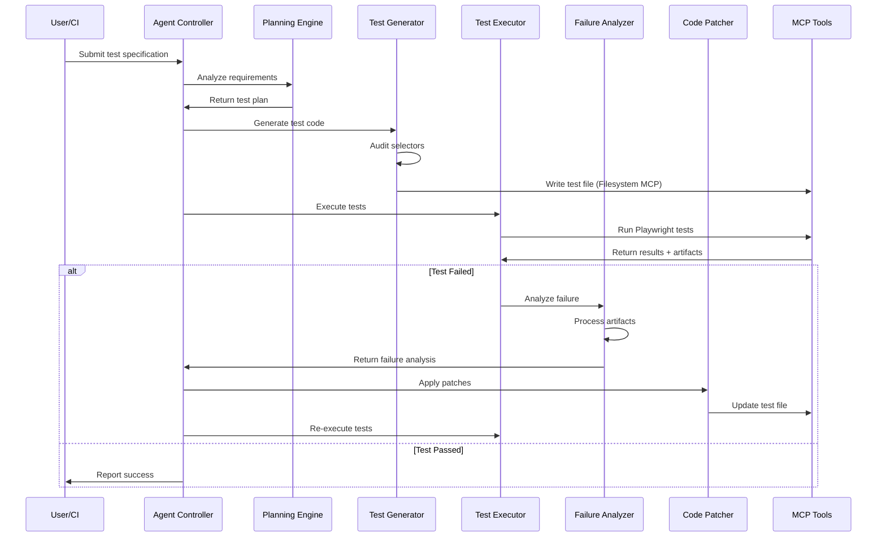
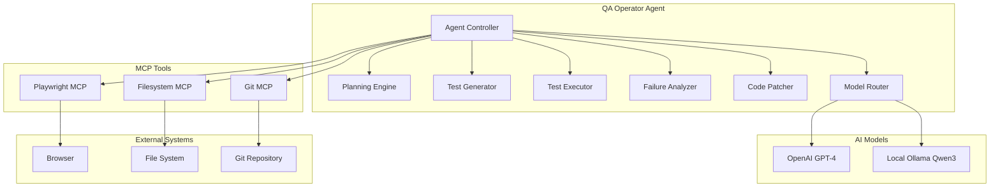

# Design Document

## Overview

The QA Operator is a Python-based intelligent testing agent built using OpenAI's Agents SDK. It automates the complete testing lifecycle: planning, generation, execution, diagnosis, and patching of Playwright end-to-end tests. The system uses Model Context Protocol (MCP) for tool integration and implements a dual-model architecture for cost optimization.

The agent operates in a continuous loop: analyze requirements → generate/update tests → execute tests → diagnose failures → patch issues → repeat. It maintains test quality through automated selector auditing and follows established testing best practices.

### Core Workflow Sequence



## Architecture

### High-Level Architecture



### Component Architecture

The system follows a modular architecture with clear separation of concerns:

1. **Agent Controller**: Main orchestration layer using Agents SDK
2. **Planning Engine**: Analyzes requirements and creates test plans
3. **Test Generator**: Creates Playwright TypeScript test files
4. **Test Executor**: Runs tests and captures results
5. **Failure Analyzer**: Diagnoses test failures using captured artifacts
6. **Code Patcher**: Applies minimal fixes to resolve issues
7. **Model Router**: Routes tasks to appropriate AI models

## Components and Interfaces

### Agent Controller

**Purpose**: Main orchestration component that coordinates the testing workflow.

**Key Methods**:
- `initialize()`: Set up MCP connections and model routing
- `run_workflow(specification)`: Execute complete testing workflow
- `handle_failure(failure_data)`: Coordinate failure analysis and patching

**Dependencies**: All other components, MCP servers

### Planning Engine

**Purpose**: Analyzes test specifications and creates structured test plans.

**Key Methods**:
- `analyze_specification(spec)`: Parse and understand test requirements
- `create_test_plan(requirements)`: Generate structured test plan
- `identify_test_gaps(existing_tests)`: Find missing test coverage

**Model Usage**: OpenAI GPT-4 for complex reasoning

### Test Generator

**Purpose**: Creates and modifies Playwright TypeScript test files.

**Key Methods**:
- `generate_test(test_plan)`: Create new test file from plan
- `update_test(existing_test, changes)`: Modify existing test
- `audit_selectors(test_code)`: Validate selector compliance against policies/selector.md
- `scaffold_page_object(page_spec)`: Create page object patterns

**Model Usage**: Ollama Qwen3 for initial drafts, OpenAI for refinement

**Selector Audit Enforcement**:
- `audit_selectors()` is called before every file write operation
- Non-compliant selectors are rejected unless justified with comments
- Audit results are logged with specific policy violations
- Failed audits prevent test file creation and require regeneration

### Test Executor

**Purpose**: Runs Playwright tests and captures comprehensive diagnostics.

**Key Methods**:
- `execute_tests(test_files, mode)`: Run tests in headed/headless mode
- `capture_artifacts(test_run)`: Collect traces, screenshots, logs to artifacts/ directory
- `parse_results(test_output)`: Extract structured results
- `cleanup_artifacts(retention_days)`: Remove old artifacts based on retention policy

**MCP Integration**: Playwright MCP for all browser operations

**Artifact Storage**: 
- **Path**: `artifacts/{timestamp}/{test_name}/` for organized storage
- **Retention**: 30 days in CI environments, 7 days in local development
- **Cleanup**: Automatic cleanup on agent startup and daily scheduled cleanup

### Failure Analyzer

**Purpose**: Diagnoses test failures using captured artifacts and proposes fixes.

**Key Methods**:
- `analyze_failure(failure_data)`: Identify root cause of failure
- `extract_error_context(stack_trace, artifacts)`: Parse failure information
- `suggest_fixes(analysis)`: Propose minimal code changes

**Model Usage**: OpenAI GPT-4 for complex failure analysis

### Code Patcher

**Purpose**: Applies targeted fixes to resolve test issues.

**Key Methods**:
- `apply_patch(test_file, patch_data)`: Modify test code
- `validate_patch(original, patched)`: Ensure patch quality
- `create_backup(test_file)`: Save original before patching

**MCP Integration**: Filesystem MCP for safe file operations

### Model Router

**Purpose**: Routes tasks to appropriate AI models based on complexity and cost.

**Key Methods**:
- `route_task(task_type, context)`: Select appropriate model
- `configure_litellm()`: Set up local model integration
- `handle_fallback(model_failure)`: Switch to backup model

**Integration**: LiteLLM for Ollama, direct OpenAI API

## Configuration and Environment

### Environment Variables

The system supports the following environment variables for configuration:

- `CI`: Set to "true" to enable CI mode (headless testing, artifact retention)
- `QA_OPERATOR_HEADLESS`: Override CI detection, force headless mode when "true"
- `QA_OPERATOR_LOG_LEVEL`: Set logging level (DEBUG, INFO, WARN, ERROR)
- `QA_OPERATOR_MODEL_PROVIDER`: Override default model routing ("openai", "ollama", "mixed")
- `QA_OPERATOR_ARTIFACT_RETENTION_DAYS`: Override default artifact retention period
- `OPENAI_API_KEY`: OpenAI API key for model access
- `OLLAMA_BASE_URL`: Base URL for local Ollama instance (default: http://localhost:11434)

### Logging Configuration

**Default Paths**:
- Development: `logs/qa-operator.log` (rotating, 10MB max, 5 files)
- CI/Production: stdout with structured JSON format
- Debug logs: `logs/debug/` directory with detailed MCP and model interaction logs

**Log Levels**:
- ERROR: Critical failures, MCP connection issues
- WARN: Fallback model usage, test flakiness detected
- INFO: Test execution results, workflow completion
- DEBUG: Detailed MCP calls, model requests/responses, selector audit details

**Structured Format**:
```json
{
  "timestamp": "2024-01-15T10:30:00Z",
  "level": "INFO",
  "component": "test_executor",
  "message": "Test execution completed",
  "metadata": {
    "test_name": "user_login_flow",
    "duration": 2.5,
    "status": "passed"
  }
}
```

### Git Integration Manager

**Purpose**: Handles version control operations when Git MCP is available.

**Key Methods**:
- `check_git_availability()`: Verify Git MCP server connection
- `stage_changes(files)`: Stage test file modifications
- `create_commit(message, changes)`: Commit changes with descriptive messages
- `create_pull_request(title, description)`: Create PR with test reports

**Fallback Behavior**:
- **Git MCP Unavailable**: Log warning and continue without version control operations
- **No Git Repository**: Skip all Git operations and log informational message
- **Permission Issues**: Log error and provide manual instructions for Git operations
- **Network Failures**: Retry with exponential backoff, then skip with warning

## Data Models

### TestSpecification

```typescript
interface TestSpecification {
  id: string;
  name: string;
  description: string;
  requirements: string[];
  priority: 'high' | 'medium' | 'low';
  tags: string[];
}
```

### TestPlan

```typescript
interface TestPlan {
  specification_id: string;
  test_cases: TestCase[];
  page_objects: PageObject[];
  setup_requirements: string[];
  estimated_duration: number;
}
```

### TestCase

```typescript
interface TestCase {
  name: string;
  description: string;
  steps: TestStep[];
  assertions: Assertion[];
  selectors: SelectorInfo[];
}
```

### TestResult

```typescript
interface TestResult {
  test_name: string;
  status: 'passed' | 'failed' | 'skipped';
  duration: number;
  artifacts: TestArtifacts;
  error_info?: ErrorInfo;
}
```

### TestArtifacts

```typescript
interface TestArtifacts {
  trace_file: string;
  screenshots: string[];
  console_logs: LogEntry[];
  network_logs: NetworkEntry[];
  video_file?: string;
}
```

### FailureAnalysis

```typescript
interface FailureAnalysis {
  root_cause: string;
  error_category: 'selector' | 'timing' | 'network' | 'assertion' | 'other';
  confidence: number;
  suggested_fixes: Fix[];
  artifacts_analyzed: string[];
}
```

## Error Handling

### MCP Connection Failures

- **Retry Strategy**: Exponential backoff with maximum 3 retries
- **Timeout Handling**: 30-second timeout per MCP operation
- **Fallback Behavior**: Graceful degradation with user notification
- **Recovery**: Automatic reconnection attempts every 60 seconds

### Model Failures

- **Primary Model Failure**: Automatic fallback to secondary model
- **Rate Limiting**: Implement exponential backoff for API calls
- **Context Length**: Automatic context truncation for large inputs
- **Network Issues**: Retry with exponential backoff

### Test Execution Failures

- **Browser Crashes**: Automatic browser restart and test retry
- **Timeout Handling**: Configurable timeouts with clear error messages
- **Resource Constraints**: Memory and CPU monitoring with alerts
- **Artifact Collection**: Ensure artifacts are saved even on crashes

### File System Operations

- **Permission Errors**: Clear error messages with suggested fixes
- **Disk Space**: Monitor available space before operations
- **Concurrent Access**: File locking to prevent conflicts
- **Backup Strategy**: Automatic backups before modifications

## Testing Strategy

### Unit Testing

- **Component Testing**: Each component has comprehensive unit tests
- **Mock Strategy**: Mock MCP servers and AI models for isolated testing
- **Coverage Target**: Minimum 90% code coverage
- **Test Framework**: pytest with fixtures for common setups

### Integration Testing

- **MCP Integration**: Test actual MCP server communication
- **Model Integration**: Test with real AI models (using test accounts)
- **End-to-End**: Full workflow testing with sample specifications
- **Performance Testing**: Load testing with multiple concurrent operations

### Test Data Management

- **Sample Tests**: Repository of sample Playwright tests for validation
- **Mock Responses**: Cached AI model responses for consistent testing
- **Artifact Samples**: Sample traces, screenshots, and logs for analysis testing
- **Configuration Variants**: Test different MCP and model configurations

### Continuous Integration

- **Automated Testing**: All tests run on every commit
- **Environment Matrix**: Test across different Python versions and OS
- **Performance Benchmarks**: Track performance metrics over time
- **Security Scanning**: Automated security vulnerability scanning

### Quality Assurance

- **Code Review**: All changes require peer review
- **Static Analysis**: Automated linting and type checking
- **Documentation**: All public APIs must be documented
- **Changelog**: Maintain detailed changelog for all releases